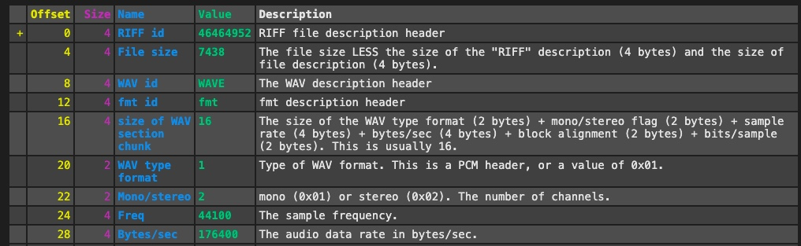
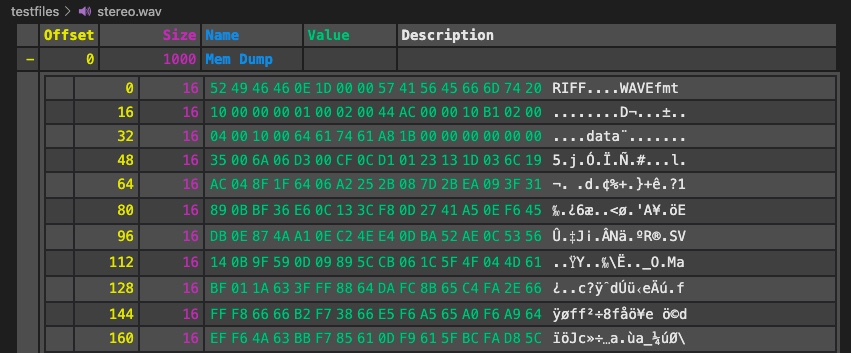
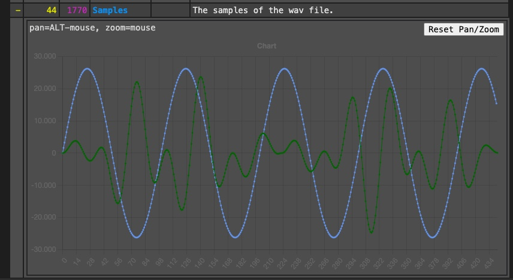
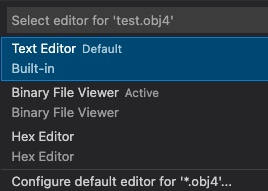
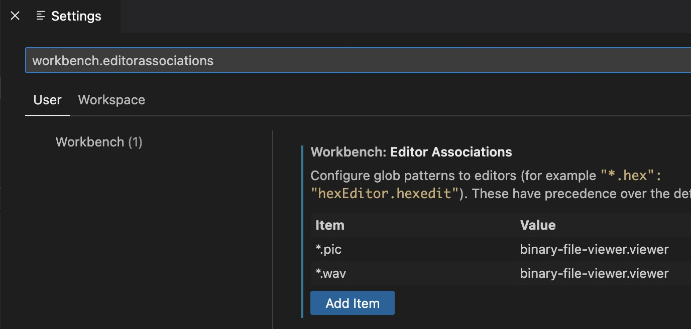

# The (Customizable) Binary File Viewer

## Support

If you like the "Binary File Viewer" please consider supporting it.

&nbsp;&nbsp;

## Help

In vscode's command palette run: 'Binary File Viewer: Show Help'.
That will open a help page explaining the concept and the available API.

There exists also a basic walkthrough. You can open it from the command palette via: 'Get Started: Open Walkthrough...' -> 'Binary File Viewer'.

## Binary File Viewer

The 'Binary File Viewer' is a framework that allows you to build your own custom viewers for binary files.
These files can be either existing file formats for which no vscode extension exists or also proprietary file formats.
I.e. file formats that you build on your own and for which you would like to have a convenient way to look inside.

To tell the 'Binary File Viewer' what files to decode and how, you have to provide a javascript file.

Besides the display of numerical and binary values there is also support for graphic visualization with charts or a canvas.

## Examples

Basic example:

Memory dump:

Charts:

## Installation

Install through Visual Studio Code Marketplace.
The extension is called "Binary File Viewer".

## Usage

To understand how to build own parser scripts please refer to the [Help](https://github.com/maziac/binary-file-viewer/blob/main/assets/local/help/help.md).

To use it:
1. In the vscode explorer right-click the binary file.
2. Choose 'Open with Binary File Viewer'.

To use the 'Binary File Viewer' as default for some file extension:
1. In the vscode explorer right-click the binary file.
2. Choose 'Open With...'.
3. If there is more than 1 viewer registered for the file type all viewers will show up, e.g.:

4. Choose 'Configure default editor for ...'
5. In the next window select the 'Binary File Viewer'.
6. The next time you select a file of the same type it is immediately opened by the 'Binary File Viewer'.

Note: The same default behavior can be achieved by editing the settings, e.g.:

## Acknowledgements

This extension makes heavy use of the "[chart.js](https://www.chartjs.org)", the "[chartjs-plugin-zoom](https://github.com/chartjs/chartjs-plugin-zoom)" and the "[hammer.js](https://github.com/hammerjs/hammer.js/tree/master/)" libraries.

Further used libraries are:
- [path](https://github.com/jinder/path)
- [posthtml-toc](https://github.com/posthtml/posthtml-toc)
- [posthtml](https://github.com/posthtml/posthtml)
- [showdown](https://github.com/showdownjs/showdown)

Many thanks to all the authors.
