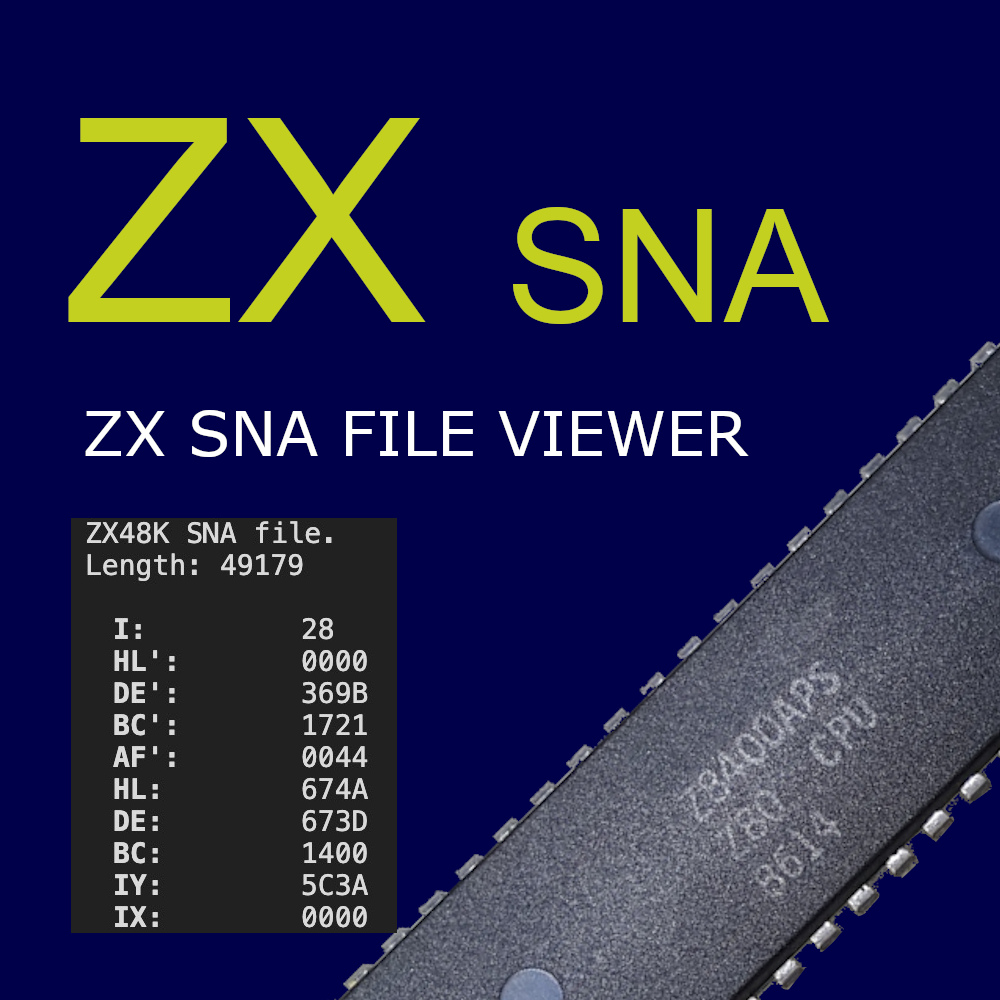

# The (Customizable) Binary File Viewer
## Important

Project is not usable yet.
Under construction !

## Support

If you like the "Binary File Viewer" please consider supporting it.

&nbsp;&nbsp;

## Binary File Viewer

...

### Installation

Install through Visual Studio Code Marketplace.
The extension is called "Binary File Viewer".

## Usage

Just click on a file with the *.* extension.
The file is opened and shown in the text editor area.

Alternatively you can open a binary file via "Open With...":

When hovering over a value or register name you will get additional info like the offset or the value in decimal:

# TODO

0, 1, 2, 5,3,6,3,

- Walkthroughs vollenden.

 - Table passt sich nicht dynamisch an die Größe an. (Window-resize.)

- Functions:
	- Functions for customizing
		- colors
		- indentation
	- Reading bits

- Wenn schon ein binary file angezeigt. Ich dann ein anderes js für diesen Typ aktiv schalte, dann wird das file nicht nochmal eingelesen.

- number-plotter: Vielleicht auch zoom/pan implementieren.